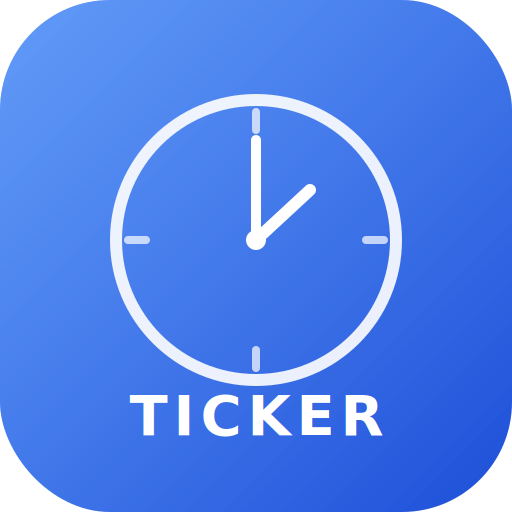

<p align="center">
  
</p>

<h1 align="center">Ticker</h1>

<p align="center">
  <strong>Your meetings, always in sight.</strong>
</p>

<p align="center">
  A native macOS menu bar app that shows a live meeting countdown,<br>
  Google Calendar-style day view, and one-click join — all without leaving your workflow.
</p>

<p align="center">
  
  
  
  
  
</p>

---

## The Problem

You're deep in code. Or writing a doc. Or in flow state. Then the thought hits:

> *"Wait, when's my next meeting?"*

You open Google Calendar in a browser tab. That tab leads to another tab. Now you're reading emails. 15 minutes gone. Meeting starts in 2 minutes and you almost missed it.

**Ticker fixes this.** It sits in your menu bar, silently counting down. When it's time, you click "Join." That's it.

---

## How It Works

```
Menu Bar:  "Standup in 23m"  →  "Standup in 45s"  →  "Standup NOW"
                                    │
                              [click menu bar]
                                    │
                    ┌───────────────────────────────────┐
                    │   ◀  Today, Mar 15  ▶             │
                    │───────────────────────────────────│
                    │   Rama Navami              All day │ ← holidays
                    │───────────────────────────────────│
                    │   9 AM ┌──────────────────┐       │
                    │        │ Team Standup  ▶   │       │ ← tap to select
                    │  10 AM └──────────────────┘       │
                    │        ───── 🔴 now ──────        │ ← current time
                    │  11 AM ┌──────────────────┐       │
                    │        │ Design Review ▶  │       │
                    │  12 PM └──────────────────┘       │
                    │───────────────────────────────────│
                    │  ▶ UP NEXT                        │
                    │  Design Review · 11:00 AM  [Join] │ ← one click join
                    │───────────────────────────────────│
                    │  ⚙ Settings              Quit     │
                    └───────────────────────────────────┘
```

---

## Features

### Live Countdown
Your next meeting name + countdown, right in the menu bar. Switches to per-second ticking when under a minute. Shows a calendar icon when your day is clear.

### Day View
A vertical timeline that looks and feels like Google Calendar. Meeting blocks are sized by duration, color-coded by calendar, and scrollable across all 24 hours. Red "now" line shows where you are.

### All Your Calendars
Fetches from **every** Google Calendar you have — primary, work, shared, subscribed, and holidays. Each one color-coded with its Google Calendar color. Optional Apple Calendar integration too.

### One-Click Join
Video icon on every meeting block. Tap any meeting to see it in the "Up Next" section with a big blue "Join" button. Works with Google Meet, Zoom, and Microsoft Teams links.

### Smart Notifications
Native macOS notifications before your meetings. Configurable — set 10 minutes, 5 minutes, or whatever you want. Each notification has a "Join Meeting" action button built in.

### Fast Navigation
Slide between days instantly. Ticker prefetches adjacent days in the background so next/prev is instant. Rapid clicking is debounced — only the final day loads.

---

## Quick Start

### Prerequisites
- macOS 13 (Ventura) or later
- Xcode 15+
- [XcodeGen](https://github.com/yonaskolb/XcodeGen): `brew install xcodegen`
- Google Cloud project with Calendar API enabled

### Build & Run

```bash
git clone https://github.com/sethraj14/ticker.git
cd ticker

# Set up Google OAuth credentials
cp Ticker/Config.xcconfig.example Ticker/Config.xcconfig
# Edit Config.xcconfig with your client ID and secret (see below)

# Generate Xcode project and build
xcodegen generate
xcodebuild -project Ticker.xcodeproj -scheme Ticker -configuration Release build

# Run it
open ~/Library/Developer/Xcode/DerivedData/Ticker-*/Build/Products/Release/Ticker.app
```

### Google OAuth Credentials

1. Go to [Google Cloud Console](https://console.cloud.google.com/)
2. Create a project (or use an existing one)
3. Enable **Google Calendar API** under APIs & Services
4. Go to **Credentials** → Create **OAuth 2.0 Client ID** (type: Desktop app)
5. Copy the client ID and secret into `Ticker/Config.xcconfig`:

```
GOOGLE_CLIENT_ID = 123456789-abc.apps.googleusercontent.com
GOOGLE_CLIENT_SECRET = GOCSPX-your-secret-here
```

### Install Permanently

```bash
cp -r ~/Library/Developer/Xcode/DerivedData/Ticker-*/Build/Products/Release/Ticker.app /Applications/
```

---

## Architecture

```
Ticker/
├── TickerApp.swift              # MenuBarExtra entry point
├── ViewModels/
│   └── CalendarViewModel.swift  # State, timers, caching, fetch
├── Services/
│   ├── GoogleCalendarService    # OAuth + Calendar API (all calendars)
│   ├── EventKitService          # Apple Calendar via EventKit
│   ├── NotificationService      # Scheduled notifications + join actions
│   └── LoopbackHTTPServer       # OAuth callback server
├── Views/
│   ├── PopoverView              # Main container with pinned header/footer
│   ├── DayTimelineView          # 24h scrollable timeline
│   ├── MeetingBlockView         # Color-coded event blocks
│   ├── JoinSection              # "Up Next" with join button
│   ├── DayNavigationBar         # Date picker with back/next
│   └── SettingsView             # Accounts, notifications, general
├── Models/
│   └── CalendarEvent            # Unified event model
└── Helpers/
    └── KeychainHelper           # File-based token storage
```

### Design Decisions

| Decision | Why |
|----------|-----|
| SwiftUI + MenuBarExtra | Native macOS 13+ API, smallest possible binary |
| No dock icon | Pure utility — `LSUIElement = true` |
| File-based token storage | Avoids Keychain password prompts on unsigned builds |
| Sliding window cache | Prefetch ±2 days for instant navigation |
| TaskGroup for calendars | All Google calendars fetched concurrently |
| XcodeGen | Reproducible builds, no `.xcodeproj` conflicts |

---

## Roadmap

- [ ] Multiple Google account support
- [ ] Calendar selection (show/hide specific calendars)
- [ ] Keyboard shortcuts
- [ ] Custom app icon for menu bar
- [ ] Homebrew cask distribution
- [ ] Week view
- [ ] Meeting conflict indicators
- [ ] Drag to reschedule

---

## Contributing

See [CONTRIBUTING.md](CONTRIBUTING.md) for setup instructions and guidelines.

**TL;DR:** Fork, branch (`feat/your-feature`), commit (conventional commits), PR.

---

## Why Open Source?

I built Ticker because I needed it. No app in the market did exactly this — a *focused*, *native*, *free* menu bar calendar that just shows the countdown and lets you join. Fantastical is great but paid and bloated for this use case. MeetingBar comes close but hasn't been updated.

If you also just want to know "when's my next meeting?" without leaving your flow — Ticker is for you. And since it's open source, you can make it exactly what you want.

---

<p align="center">
  <sub>Built by <a href="https://github.com/sethraj14">Rajdeep Gupta</a> with Claude Code.</sub><br>
  <sub><em>Because checking your calendar shouldn't require opening a browser.</em></sub>
</p>
